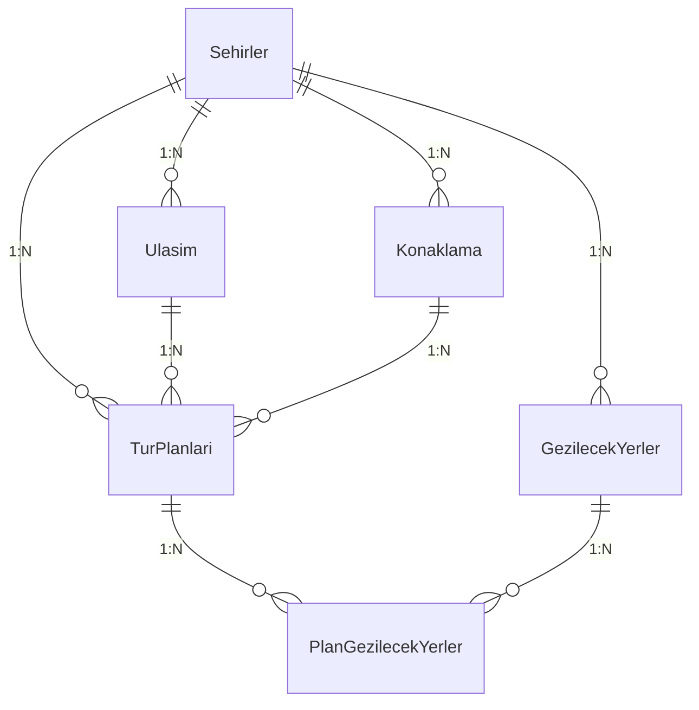
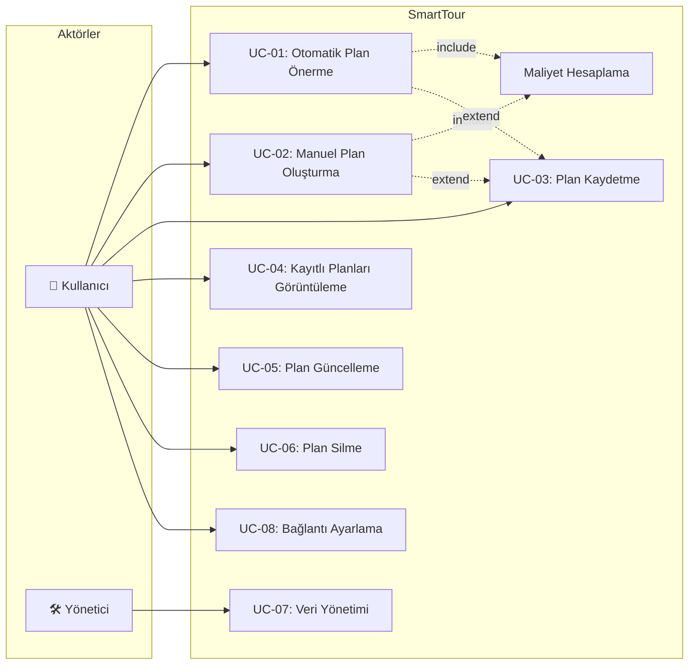
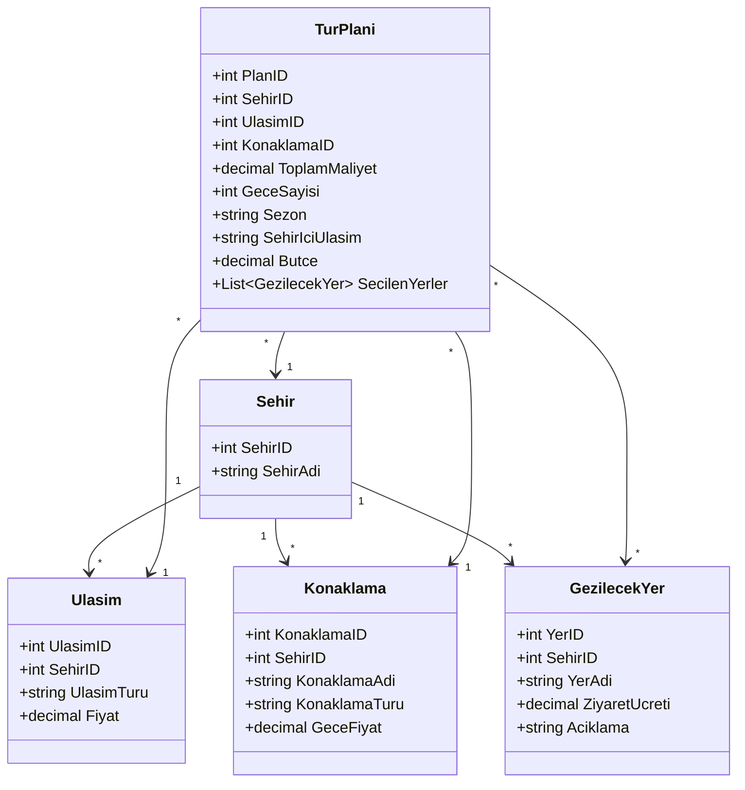
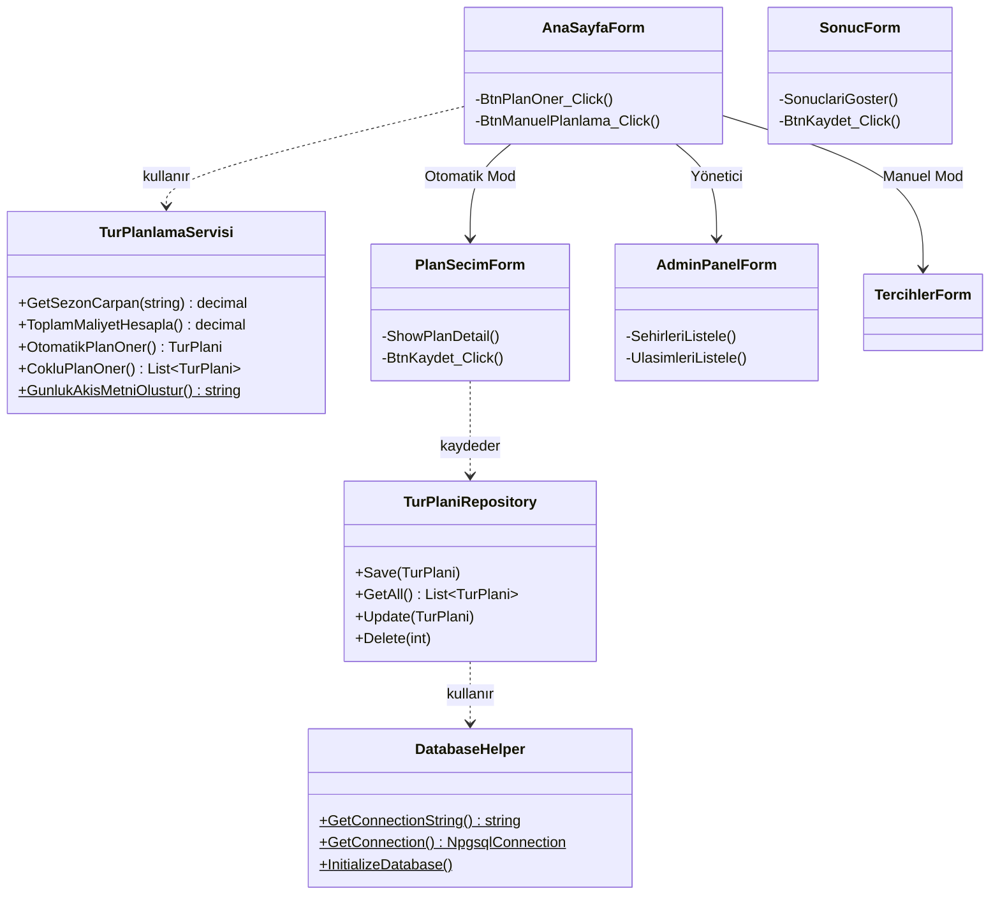

# SmartTour – Akıllı Tatil Planlama Otomasyonu
## Proje Raporu

**Geliştirme Ortamı:** Visual Studio / .NET, C# Windows Forms  
**Veritabanı:** PostgreSQL (Supabase Bulut)  
**Tarih:** Haziran 2026

---

# GRUP BİLGİSİ

| # | Ad Soyad | Görev | Öğrenci No |
|---|----------|-------|------------|
| 1 | Sabri Duruk | Veritabanı & DataAccess Katmanı | 032290020 |
| 2 | Mehmet Kalbişen | Form Tasarımları & UI | 032390011 |
| 3 | Efe Tutucu | İş Mantığı & Algoritmalar | 032390034 |


---

# 1. PROJE HAKKINDA DETAYLI BİLGİ (TANITIM)

## 1.1 Projenin Amacı

SmartTour, kullanıcıların belirlediği bütçe, şehir, gece sayısı ve sezon bilgisine göre **otomatik tatil planı öneren** bir masaüstü uygulamasıdır. Ulaşım, konaklama ve gezilecek yer fiyatlarını veritabanında tutarak, bütçeye en uygun kombinasyonları algoritmik olarak hesaplar ve birden fazla alternatif plan sunar.

## 1.2 Temel Özellikler

- **Otomatik Plan Önerme** — Greedy algoritma ile bütçeye uygun 5 farklı plan üretme
- **Manuel Planlama** — Kullanıcının kendi tercihlerini seçerek plan oluşturması
- **Sezon Sistemi** — Yaz (+%40), Bahar (normal), Kış (-%20) fiyat çarpanları
- **Günlük Program** — Gezilecek yerlerin sabah/öğle/akşam olarak günlere dağıtılması
- **Admin Paneli** — Şehir, ulaşım, konaklama ve yer verilerinin CRUD yönetimi
- **Plan CRUD** — Planları kaydetme, görüntüleme, güncelleme ve silme

## 1.3 Kullanılan Teknolojiler

| Teknoloji | Açıklama |
|---|---|
| C# (.NET) | Ana programlama dili |
| Windows Forms | Masaüstü UI framework'ü |
| PostgreSQL / Supabase | Bulut veritabanı |
| Npgsql | .NET PostgreSQL sağlayıcısı |

## 1.4 Proje Katman Mimarisi

```
SmartTour/
├── Models/           → Veri modelleri (Sehir, Ulasim, Konaklama, GezilecekYer, TurPlani)
├── DataAccess/       → Veritabanı erişimi (DatabaseHelper, Repositories)
├── BusinessLogic/    → Hesaplama motoru (TurPlanlamaServisi)
├── Forms/            → 7 kullanıcı arayüzü formu + 1 alt form
└── Program.cs        → Uygulama giriş noktası
```


---

# 2. VERİTABANI YAPISI VE PROGRAM İLE İLİŞKİSİ

## 2.1 Veritabanı Şeması (6 Tablo)

| Tablo | Sütunlar | Açıklama |
|---|---|---|
| **Sehirler** | `SehirID` (PK), `SehirAdi` | 5 şehir: İstanbul, Antalya, İzmir, Kapadokya, Bodrum |
| **Ulasim** | `UlasimID` (PK), `SehirID` (FK), `UlasimTuru`, `Fiyat` | Otobüs, Uçak, Tren seçenekleri |
| **Konaklama** | `KonaklamaID` (PK), `SehirID` (FK), `KonaklamaAdi`, `KonaklamaTuru`, `GeceFiyat` | Otel, Pansiyon, Apart, Hostel vb. |
| **GezilecekYerler** | `YerID` (PK), `SehirID` (FK), `YerAdi`, `ZiyaretUcreti`, `Aciklama` | Turistik noktalar ve giriş ücretleri |
| **TurPlanlari** | `PlanID` (PK), `SehirID`/`UlasimID`/`KonaklamaID` (FK), `GeceSayisi`, `Butce`, `ToplamMaliyet`, `Sezon`, `SehirIciUlasim`, `SehirIciMaliyet`, `OlusturmaTarihi` | Kaydedilen planlar |
| **PlanGezilecekYerler** | `PlanID` (FK), `YerID` (FK) — Bileşik PK, CASCADE silme | Çoka-çok ilişki tablosu |

## 2.2 ER Diyagramı




## 2.3 Program ile Veritabanı İlişkisi

### DatabaseHelper.cs
- **Bağlantı yönetimi:** Önce `db_config.txt` → yoksa Supabase varsayılan → başarısızsa BaglantiAyarlariForm açılır (3 deneme)
- **`InitializeDatabase()`:** Uygulama başlangıcında tabloları oluşturur, seed data ekler ve migration'ları çalıştırır
- **Migration sistemi:** Eski veritabanlarına yeni sütunları (`GeceSayisi`, `Butce`, `Sezon` vb.) otomatik ekler

### Repository Pattern (Repositories.cs)
Her tablo için ayrı Repository sınıfı veritabanı işlemlerini soyutlar:

| Repository | Metotlar |
|---|---|
| `SehirRepository` | `GetAll()` |
| `UlasimRepository` | `GetBySehirId(int)` |
| `KonaklamaRepository` | `GetBySehirId(int)` |
| `GezilecekYerRepository` | `GetBySehirId(int)` |
| `TurPlaniRepository` | `Save()`, `GetAll()`, `Update()`, `Delete()` |

`TurPlaniRepository.GetAll()` 4 tabloyu JOIN ederek plan bilgilerini getirir, ardından her plan için gezilecek yerleri ayrı sorguyla yükler.


---

# 3. SİSTEM İLE KULLANICI ARAYÜZLERİNİN AYRI AYRI ANLATIMI

## 3.1 Sistem Tarafı

### Uygulama Başlatma (Program.cs)
1. Windows Forms altyapısı başlatılır
2. `DatabaseHelper.InitializeDatabase()` → veritabanı bağlantısı, tablo oluşturma, seed data
3. Başarılıysa `AnaSayfaForm` açılır; hata olursa mesaj gösterilip uygulama kapanır

### İş Mantığı (TurPlanlamaServisi.cs)

**Sezon Çarpanı:** Yaz → ×1.4 | Bahar → ×1.0 | Kış → ×0.8

**Maliyet Formülü:**
```
Toplam = (Ulaşım × Sezon) + (Konaklama/gece × Sezon × Gece) + Σ(Gezi Ücretleri) + (Şehiriçi × Gece)
```

**Şehir İçi Ulaşım:** Toplu Taşıma 50₺/gün | Taksi 300₺/gün | Araç Kiralama 900₺/gün

**Otomatik Plan Önerme (Greedy):** Bütçeye uyan en ucuz ulaşım → en kaliteli konaklama → bütçeye göre şehir içi ulaşım → ucuzdan pahalıya gezilecek yerleri sığdır

**Çoklu Plan Üretme:** Tüm (ulaşım × konaklama) kombinasyonlarını dener, ulaşım türüne göre gruplar, her gruptan medyan fiyatlı planı seçer, 5 plana tamamlar

**Günlük Program:** Gezilecek yerleri günlere dengeli dağıtır, sabah/öğle/akşam zaman dilimi atar

---

## 3.2 Kullanıcı Arayüzü (8 Form)

### Uygulama Akış Şeması

```
AnaSayfaForm (giriş)
    ├─► [Otomatik] PlanSecimForm ──► SonucForm
    ├─► [Manuel]   TercihlerForm ──► SonucForm
    ├─► KayitliPlanlarForm ──► PlanGuncelleForm
    └─► AdminPanelForm
         └── BaglantiAyarlariForm (hata durumunda otomatik açılır)
```

---

### 3.2.1 AnaSayfaForm — Ana Sayfa
Uygulamanın giriş ekranı. Şehir seçimi, bütçe, gece sayısı ve sezon girişi yapılır.
- Mavi gradient header (fare hareketi ile renk değişir)
- Şehir arama/filtreleme, binlik ayraçlı bütçe girişi
- 4 buton: Plan Öner (yeşil), Kayıtlı Planlar (mavi), Manuel Planlama (gri), Yönetici (turuncu)


### 3.2.2 TercihlerForm — Manuel Planlama
Kullanıcının tüm tercihleri elle seçtiği form.
- Ulaşım, konaklama ve gezilecek yerler için **isim arama + fiyat aralığı filtresi**
- Gezilecek yerler CheckedListBox ile çoklu seçim; ToolTip ile açıklama gösterimi
- Sezon ve şehir içi ulaşım yan yana seçim kutuları


### 3.2.3 PlanSecimForm — Plan Karşılaştırma
Algoritmanın önerdiği 5 planın listelendiği ve düzenlendiği form.
- Sol: Plan listesi | Sağ: Seçili planın maliyet dökümü + günlük ajanda
- Alt bölüm: Ulaşım/konaklama/gezilecek yer değiştirme + 🔄 Güncelle butonu
- 💾 Kaydet ve ← Geri butonları


### 3.2.4 SonucForm — Plan Sonuç Ekranı
Planın maliyet dökümü ve günlük seyahat ajandası.
- ASCII çerçeveli detaylı maliyet raporu
- Bütçe durumu: ✅ Bütçeye Uygun (yeşil) / ⚠️ Bütçe Aşıldı (kırmızı)
- Çift tıklama ile panoya kopyalama özelliği


### 3.2.5 KayitliPlanlarForm + PlanGuncelleForm
Kaydedilmiş planların listelenmesi, silinmesi ve güncellenmesi.
- DataGridView tablosu (çift renk şeritli) + sağ panel detay
- ✏️ Güncelle → PlanGuncelleForm açılır (ulaşım/konaklama/yer değiştirme)
- 🗑️ Sil → onay sonrası CASCADE silme


### 3.2.6 AdminPanelForm — Yönetici Paneli
4 sekmeli CRUD arayüzü (turuncu tema):
- 🌆 Şehirler | 🚌 Ulaşımlar | 🏨 Konaklamalar | 📍 Gezilecek Yerler
- Her sekmede: şehir filtreli DataGridView + sağ tarafta ekleme kontrolleri + Ekle/Sil butonları
- Şehir silme: bağlı tüm veriler kademeli silinir


---

# 4. USE-CASE MODELLER

## Aktörler

| Aktör | Açıklama |
|---|---|
| **Kullanıcı** | Tatil planlamak isteyen son kullanıcı |
| **Yönetici** | Sistem verilerini yöneten yetkili kişi |
| **Sistem** | Otomatik hesaplama ve veri yönetimi yapan yazılım |

## Use Case Listesi

### UC-01: Otomatik Plan Önerme
**Aktör:** Kullanıcı → **Akış:** Şehir, bütçe, gece, sezon seç → "Plan Öner" tıkla → Sistem 5 plan hesaplar → PlanSecimForm'da listeler → **Alternatif:** Uygun plan yoksa bilgi mesajı

### UC-02: Manuel Plan Oluşturma
**Aktör:** Kullanıcı → **Akış:** Şehir seç → "Manuel Planlama" tıkla → Ulaşım, konaklama, gezilecek yerleri seç → "Plan Oluştur" tıkla → Maliyet hesaplanır → SonucForm'da gösterilir

### UC-03: Plan Kaydetme
**Aktör:** Kullanıcı → **Akış:** Plan oluşturulduktan sonra "Planı Kaydet" tıkla → Plan + gezilecek yerler veritabanına kaydedilir

### UC-04: Kayıtlı Planları Görüntüleme
**Aktör:** Kullanıcı → **Akış:** "Kayıtlı Planlar" tıkla → Tüm planlar DataGridView'de listelenir → Seçilen planın detayı gösterilir

### UC-05: Plan Güncelleme
**Aktör:** Kullanıcı → **Akış:** Kayıtlı plan seç → "Güncelle" tıkla → PlanGuncelleForm'da ulaşım/konaklama/yer değiştir → Maliyet yeniden hesaplanır → Kaydedilir

### UC-06: Plan Silme
**Aktör:** Kullanıcı → **Akış:** Kayıtlı plan seç → "Sil" tıkla → Onay → Plan ve ilişkili kayıtlar silinir (CASCADE)

### UC-07: Veri Yönetimi (Admin)
**Aktör:** Yönetici → **Akış:** "Yönetici" tıkla → AdminPanelForm'da 4 sekmede şehir/ulaşım/konaklama/yer ekleme-silme işlemleri

### UC-08: Veritabanı Bağlantı Ayarlama
**Aktör:** Kullanıcı/Sistem → **Akış:** Bağlantı hatası → BaglantiAyarlariForm açılır → Bilgiler girilir → Test edilir → Başarılıysa kaydedilir

---

# 5. USE-CASE DİYAGRAMI



---

# 6. CLASS DİYAGRAMI

## 6.1 Model Sınıfları



## 6.2 Servis, Repository ve Form Sınıfları


---


